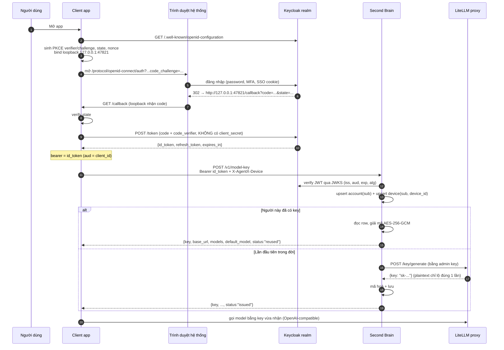

# AgentX — Đăng nhập Keycloak & cấp model key qua Second Brain

> **File này là instruction để tích hợp, không phải tài liệu nội bộ của netMind Extension.**
> Copy nguyên file vào repo của sản phẩm mới (đặt cạnh `AGENTS.md` / `CLAUDE.md` hoặc trong
> `docs/`), rồi bảo agent/lập trình viên đọc nó trước khi viết code auth. Mọi thứ cần biết để
> nói chuyện được với hệ thống — realm, wire contract, mã lỗi, thứ tự thao tác, các bẫy đã
> vấp — đều nằm ở đây; không cần đọc source của netMind Extension.

**Bản thân hệ thống trả lời đúng một câu hỏi:** *"Người này là ai, và họ được dùng model key
nào?"* — cho nhiều thiết bị của cùng một người, mà thiết bị sau không giết key của thiết bị trước.

---

## 0. TL;DR — luồng tối thiểu cho một sản phẩm mới

```
1. Đăng nhập  : OAuth2 Authorization Code + PKCE (S256) tới Keycloak realm, public client,
                redirect về loopback 127.0.0.1:{47821|47822|47823}/callback (desktop)
2. Token      : LẤY id_token (KHÔNG phải access_token) làm bearer cho mọi request nội bộ
3. Device id  : sinh UUIDv4 một lần cho mỗi INSTALL, lưu cạnh app data, gửi kèm mọi request
4. Lấy key    : POST {BRAIN}/v1/model-key
                Authorization: Bearer <id_token>
                X-AgentX-Device: <uuid>
                body {"rotate": false}
5. Dùng key   : response.key + response.base_url + "/v1"  → OpenAI-compatible client
                response.default_model → model mặc định
6. Xử lý lỗi  : 403 device_revoked → bắt đăng nhập lại. Mọi lỗi khác (5xx, timeout, DNS)
                → GIỮ NGUYÊN key đang có, thử lại lần sau. Không bao giờ xoá key vì lỗi mạng.
```

Bốn dòng đầu là bắt buộc. Dòng cuối là thứ hay bị làm sai nhất.

---

## 1. Bức tranh tổng thể

Bốn thành phần, mỗi thành phần giữ đúng một thứ:

| Thành phần | Giữ cái gì | Chạy ở đâu |
|---|---|---|
| **Keycloak realm** | danh tính người dùng (`sub`, email, name), MFA, SSO | hạ tầng auth có sẵn của tổ chức |
| **Second Brain service** | 1 model key/người (đã mã hoá), danh sách device, change feed | **một server bạn kiểm soát** |
| **LiteLLM proxy** | các model thật + hạn mức chi tiêu theo key | server nội bộ |
| **Client app** | token phiên + device id + bản sao key trong `.env` | máy người dùng |

**Admin key của LiteLLM chỉ tồn tại trên Second Brain.** Không bao giờ đóng gói nó vào
installer, không đưa xuống máy client — đó chính là lỗi mà kiến trúc này sinh ra để sửa.



---

## 2. Bảy nguyên tắc bất biến — đọc kỹ trước khi code

Đây không phải "best practice" chung chung. Mỗi dòng dưới đây là một bug đã xảy ra thật.

### R1. Token quyết định account. Luôn luôn.

Account được suy ra **duy nhất** từ claim `sub` đã verify. Không có tham số `account`,
`subject`, `user_id` nào trong body/query được tin. Nếu API của bạn cho phép client tự khai
tên account thì bất kỳ ai cũng xin được key của người khác bằng cách sửa một field JSON.

### R2. Dùng **ID token**, không dùng access token.

Keycloak phát cả hai. Nhưng access token có `aud: account`, còn ID token có `aud = client_id`
của bạn — và pin `aud` chính là thứ chặn token phát cho client khác bị replay sang đây. Vì vậy
ID token là thứ nằm ở ô "bearer" của mọi request nội bộ.

`expiresAt` lấy từ claim `exp` của chính ID token, **không** tính từ `expires_in`: server
enforce theo `exp`, tính theo duration sẽ lệch đồng hồ và bạn gửi lên token mà server đã coi là chết.

### R3. Mất kết nối ≠ bị thu hồi.

| Tình huống | Server trả | Client phải làm |
|---|---|---|
| Token hết hạn / sai chữ ký / sai realm | `401 invalid_token` | vứt token, đăng nhập lại |
| **Không hỏi được Keycloak** (JWKS timeout) | `503 identity_unavailable` | **giữ nguyên token**, thử lại sau |
| Database không với tới được | `503 store_unavailable` | giữ nguyên mọi thứ, thử lại |
| Device đã bị thu hồi | `403 device_revoked` | đăng nhập lại trên máy này |

Nhầm 503 thành 401 = đăng xuất cả fleet mỗi lần JWKS endpoint nấc một cái. Cùng logic đó áp
cho refresh token phía client: **HTTP 400/401/403 + `invalid_grant`** nghĩa là phiên đã chết;
mọi thứ khác (socket error, timeout, 5xx, captive portal) là mạng — giữ session lại. Khi không
phân loại được thì mặc định coi là "mạng": đoán sai kiểu đó tốn thêm một request, đoán sai
kiểu kia làm người dùng bị đá ra.

### R4. Một người = một model key. Mint đúng một lần.

Lần gọi đầu tiên của một `sub` sẽ mint ở LiteLLM. **Mọi lần gọi sau — từ máy đó hay máy nào
khác — đọc bản đã lưu và không hề gọi LiteLLM.** Việc mint diễn ra dưới advisory lock theo
`subject`, nên hai máy đăng nhập cùng lúc vẫn chỉ ra một key.

Điều này ép một hệ quả: **plaintext của key phải được lưu lại**. LiteLLM chỉ trả plaintext
đúng một lần (`/key/list`, `/key/info` chỉ trả hash), nên nếu không giữ thì máy thứ hai không
có gì để nhận. Nó được bọc AES-256-GCM dưới KEK đọc từ env, với `subject` làm AAD (một row bị
bê sang subject khác sẽ không mở được), và `kek_id` lưu theo từng row để xoay KEK không cần downtime.

### R5. Không bao giờ xoá key theo alias.

Alias (`agentx-workmate-<account_slug>`) là **nhãn để đọc trong console LiteLLM**, không phải
handle. Tất cả các máy của cùng một người đội chung một alias — nên "xoá key đang mang alias
này rồi mint cái mới" chính là xoá key đang chạy của cái laptop kia. Chỉ xoá theo
`litellm_token` được ghi trên đúng row đang bị thay thế, và chỉ khi rotate tường minh.

### R6. Device id thuộc về **bản cài đặt**, không thuộc về người.

Lưu nó cạnh app data của install (Electron `userData`, hoặc install root), **không** lưu trong
home theo từng account. Đăng xuất rồi đăng nhập bằng tài khoản khác không được biến một máy
thành hai máy. Đổi lại, primary key ở server là `(subject, device_id)` chứ không phải
`device_id` — hai người dùng chung một laptop hợp lệ gửi lên cùng một id.

### R7. Mọi request đều phải khai tên máy.

Thiếu `X-AgentX-Device` → `400 device_header_missing`. Không phải khó tính vô cớ: một danh
sách thiết bị không chỉ ra được "cái nào là máy tôi đang ngồi" là danh sách không ai dám bấm
nút thu hồi.

---

## 3. Cấu hình phía Keycloak (làm một lần, cho cả fleet)

Client cho app desktop:

| Thiết lập | Giá trị | Vì sao |
|---|---|---|
| Client type | **Public** (không client secret) | binary chạy trên máy nhân viên không giữ nổi secret |
| Standard flow | Bật | authorization code |
| PKCE method | **S256** | thứ authenticate cho code exchange thay cho secret |
| Direct access grants | Tắt | realm có MFA/required-actions không thoả mãn được password grant |
| Valid redirect URIs | `http://127.0.0.1:47821/callback`<br/>`http://127.0.0.1:47822/callback`<br/>`http://127.0.0.1:47823/callback` | Keycloak chỉ hỗ trợ wildcard đuôi `*`, mà backend bind cổng ephemeral — nên phải pin cổng cố định |
| Web origins | để trống (hoặc `+`) | không có XHR từ browser trong luồng này |
| Scopes mặc định | `openid profile email` | thiếu `openid` thì **không có id_token** |

Ba cổng loopback là **contract công khai**: đổi một cổng là làm hỏng mọi install đã cấu hình
theo danh sách cũ. Ba cái để một tiến trình khác chiếm cổng (hoặc một cửa sổ app thứ hai đang
đăng nhập dở) không làm người dùng tắc đường.

Nếu sản phẩm mới là **web app**, không dùng loopback: dùng authorization code + PKCE chuẩn với
redirect URI công khai của bạn, phần còn lại của tài liệu này (R1–R7, wire contract, mã lỗi)
giữ nguyên không đổi.

---

## 4. Luồng đăng nhập, từng bước

### 4.1 Lấy cấu hình OIDC

Hai cách, ưu tiên cách một:

**a) Hỏi backend của chính bạn** — `GET {BACKEND}/api/auth/providers`, route công khai:

```json
{
  "providers": [
    {
      "name": "keycloak",
      "display_name": "AgentX",
      "supports_password": false,
      "supports_native_oidc": true,
      "native_oidc": {
        "issuer": "https://agentx.example.com/auth/realms/agent-hub",
        "client_id": "agentx-workmate",
        "scopes": "openid profile email",
        "confidential": false
      }
    }
  ]
}
```

Chọn entry đầu tiên có `native_oidc` và `confidential === false`. `confidential: true` nghĩa là
client này cần secret → luồng public-client PKCE không chạy được, phải fallback sang luồng
brokered (redirect qua backend). Không có entry nào hợp lệ ⇒ *fallback*, không phải *crash boot*.

Lợi ích: đổi realm là đổi cấu hình một server, không cần build lại desktop.

**b) Hard-code `issuer` + `client_id`** trong config của app. Đơn giản hơn, nhưng mỗi lần
migrate realm là một lần ship bản mới.

### 4.2 Discovery + pin issuer

`GET {issuer}/.well-known/openid-configuration`, rồi **so `issuer` mà document tự quảng cáo với
`issuer` bạn đã cấu hình** (chỉ tha thứ khác biệt dấu `/` cuối). Lệch nhau nghĩa là document
đến từ chỗ khác (proxy, typo, bị chèn giữa đường) — đi theo endpoint của nó là gửi credential
của người dùng tới đó.

Ép thêm: `authorization_endpoint` và `token_endpoint` phải là **https**, hoặc http trên
loopback (`localhost`, `127.0.0.1`, `[::1]`). Không có ngoại lệ nào khác.

### 4.3 Loopback + authorize URL

- Bind `127.0.0.1` (không phải `0.0.0.0`) trên cổng cố định đầu tiên còn trống trong
  `[47821, 47822, 47823]`. `EADDRINUSE`/`EACCES` → thử cổng kế tiếp; hết danh sách mới báo lỗi,
  và thông báo lỗi phải nêu đủ ba cổng để người dùng tìm ra thủ phạm.
- Sinh `code_verifier`/`code_challenge` (S256), `state`, `nonce` bằng CSPRNG.
- Mở **trình duyệt hệ thống** (RFC 8252 BCP), không phải WebView/BrowserWindow nhúng: đó là thứ
  cho nhân viên đã đăng nhập AgentX trong browser đi thẳng qua bằng cookie SSO có sẵn.

```
{authorization_endpoint}
  ?response_type=code
  &client_id={client_id}
  &redirect_uri=http://127.0.0.1:{port}/callback
  &scope=openid profile email
  &state={state}
  &nonce={nonce}
  &code_challenge={challenge}
  &code_challenge_method=S256
```

- Timeout 5 phút rồi đóng listener.
- Trang trả về trình duyệt **luôn** là "bạn có thể đóng cửa sổ này" — kể cả khi thất bại.
  Trình duyệt không được biết token, cũng không được biết kết quả. (Trả 200 cho cả request
  favicon nữa, để nó không trông như một lần lỗi.)

### 4.4 Đổi code lấy token

Verify `state` **trước khi** đổi code (RFC 6749 §10.12). Rồi POST `token_endpoint`,
`application/x-www-form-urlencoded`:

```
grant_type=authorization_code
client_id={client_id}
code={code}
code_verifier={verifier}
redirect_uri=http://127.0.0.1:{port}/callback
```

**Không có `client_secret`.** Client là public, PKCE là thứ authenticate cho lần exchange này.
Đừng để tồn tại code path nào có thể gửi secret lên.

Code chỉ dùng được một lần và Keycloak đốt nó ngay lần thử đầu — **exchange hỏng thì phải chạy
lại cả luồng từ đầu, không được retry cái POST đó.**

Chuẩn hoá response:

```ts
{
  accessToken : payload.id_token,          // R2 — id_token nằm ở ô này
  refreshToken: payload.refresh_token,
  expiresAt   : claims.exp,                // từ chính id_token, không từ expires_in
  provider    : 'keycloak',
  userId      : claims.sub,
  email       : claims.email,
  displayName : claims.name ?? claims.preferred_username ?? claims.email
}
```

Được phép decode payload JWT **không verify** ở đúng chỗ này và chỉ chỗ này — token vừa nhận
trực tiếp từ Keycloak qua TLS, và những gì đọc ra chỉ dùng để hiển thị + biết khi nào refresh.
Không có quyết định phân quyền nào dựa trên nó; server verify lại chữ ký/iss/aud ở mọi request.

### 4.5 Lưu token & thang refresh

Lưu vào **OS keychain** (Electron `safeStorage`, Keychain, DPAPI, libsecret), không phải file
phẳng. Nhưng: **lưu hỏng không được làm mất phiên vừa đăng nhập** — keychain có thể đang khoá,
và ném lỗi ở đây sẽ đẩy người dùng vào vòng lặp đăng nhập vô tận trong khi lần exchange nào
cũng thành công. Log lại, dùng token cho phiên hiện tại, và chấp nhận hỏi lại ở lần mở sau.

Thang xử lý mỗi lần khởi động:

```
1. có session lưu, chưa gần hết hạn        → dùng luôn                (outcome: stored)
2. gần hết hạn, refresh thành công          → dùng bản mới             (outcome: refreshed)
3. refresh bị TỪ CHỐI (400/401/403,
   invalid_grant)                           → xoá session, đăng nhập lại (needs-login)
4. refresh KHÔNG GỌI ĐƯỢC (offline, DNS,
   5xx, Keycloak restart)                   → GIỮ session cũ, đi tiếp   (stale-offline)
5. không có gì được lưu                     → đăng nhập                 (signed-in)
```

Rung 3 và rung 4 khác nhau ở đúng một chỗ và đó là chỗ quan trọng nhất của toàn bộ mục này.
Keycloak mặc định xoay refresh token — nhưng realm có thể tắt; nếu response mới không kèm
refresh token thì **giữ lại cái cũ**, đừng để mất luôn khả năng refresh.

Cho phép chế độ `interactive: false`: rung 3 và 5 trả về "cần đăng nhập" thay vì tự mở trình
duyệt — đó là thứ cho phép màn hình boot hiện nút "Đăng nhập" thay vì bắn browser vào mặt
người dùng lúc họ chưa yêu cầu.

### 4.6 Đăng xuất

Xoá session lưu trữ **và** mở `end_session_endpoint` kèm `id_token_hint={id_token}`. Bỏ bước
thứ hai thì cookie SSO của Keycloak vẫn còn, và lần "đăng nhập" kế tiếp sẽ lặng lẽ đăng nhập
lại đúng người vừa đăng xuất.

Việc revoke refresh token (RFC 7009) là best-effort và **không bao giờ được ném lỗi**.

---

## 5. Device identity

```ts
export const DEVICE_ID_HEADER   = 'X-AgentX-Device'
export const DEVICE_NAME_HEADER = 'X-AgentX-Device-Name'
export const DEVICE_ID_RE = /^[0-9a-f]{8}-[0-9a-f]{4}-[0-9a-f]{4}-[0-9a-f]{4}-[0-9a-f]{12}$/
```

- **id**: UUIDv4 sinh một lần, lưu ở app data của install (`device.json`: `{id, name, createdAt}`).
  Server nhận không phân biệt hoa thường rồi hạ về lowercase — Postgres chuẩn hoá UUID, và hai
  cách viết của một id không được biến thành hai thiết bị.
- **name**: hostname đã làm sạch — bỏ mọi ký tự ngoài `[A-Za-z0-9 ._-]`, gộp khoảng trắng, cắt
  còn **64 ký tự**. Header không mang nổi CR/LF, mà tên máy là thứ người dùng gõ tuỳ ý. Tên chỉ
  để **hiển thị**, không bao giờ để tin.
- **Parse phải toàn phần**: file cụt hoặc bị sửa tay thì sinh id mới, **không ném lỗi**. Chi phí
  hai bên lệch nhau rất xa — id mới tốn một dòng thừa trong danh sách thiết bị mà người dùng
  xoá được, còn một exception ở đây tốn cả cái app.
- Record không hợp lệ ⇒ trả **object rỗng** thay vì header méo: thiếu header là trường hợp
  server trả `400 device_header_missing` rất rõ ràng, còn header méo là trường hợp không ai nghĩ tới.

---

## 6. Wire contract của Second Brain

Base URL do operator cấu hình. Prefix `/v1` là lời hứa tương thích.

### 6.1 Header dùng chung

| Header | Bắt buộc | Nội dung |
|---|---|---|
| `Authorization` | ✅ | `Bearer <id_token>` |
| `X-AgentX-Device` | ✅ | UUID của install |
| `X-AgentX-Device-Name` | — | tên máy để hiển thị (≤64 ký tự, đã làm sạch) |
| `Accept` | — | `application/json` |

Mọi route đều verify bearer **và** upsert device trước khi handler chạy. Việc upsert kiêm luôn
kiểm tra thu hồi trong một câu lệnh — không có khe hở giữa lúc đọc "chưa bị thu hồi" và lúc hành động.

### 6.2 Danh sách endpoint

| Method | Path | Công dụng |
|---|---|---|
| `GET` | `/health` | trạng thái từng dependency; 503 **chỉ khi** Postgres chết |
| `GET` | `/v1/me` | bạn là ai, đang ở máy nào (route rẻ để kiểm tra máy còn được phép không) |
| `POST` | `/v1/model-key` | **lấy key của người này**, chỉ mint khi họ chưa có |
| `POST` | `/v1/devices/heartbeat` | khai platform + app version |
| `GET` | `/v1/devices` | mọi máy người này từng đăng nhập |
| `DELETE` | `/v1/devices/{id}?rotate_key=bool` | thu hồi một máy, tuỳ chọn cắt luôn quyền dùng model |
| `POST` | `/v1/sync/push` | đẩy document đã đổi lên feed |
| `GET` | `/v1/sync/changes?since=&limit=&kinds=` | một trang của feed, cũ trước |
| `GET` | `/v1/search?q=` | full-text trên document của chính mình |
| `WS` | `/v1/sync/stream` | báo có thay đổi (chỉ là cú hích, không mang document) |

### 6.3 `POST /v1/model-key` — route quan trọng nhất

**Request**

```http
POST /v1/model-key HTTP/1.1
Authorization: Bearer <id_token>
X-AgentX-Device: 6f1c2c7a-9a3e-4a1d-8f0b-2c9d1e5f7a01
X-AgentX-Device-Name: MacBook Pro
Content-Type: application/json

{"rotate": false}
```

**Response 200**

```json
{
  "key": "sk-...",
  "key_alias": "agentx-workmate-kien-3f9a1c2b",
  "token": "<hash LiteLLM dùng để gọi tên key này>",
  "base_url": "https://litellm.example.com",
  "models": ["qwen3-chat", "gpt-4o-mini", "flux-1"],
  "default_model": "qwen3-chat",
  "status": "reused",
  "account": "kien-3f9a1c2b",
  "created_at": "2026-08-01T09:14:22+00:00",
  "rotated_at": null
}
```

| Field | Ý nghĩa |
|---|---|
| `key` | plaintext của virtual key. Ghi vào `.env`, **không bao giờ log** (chỉ log dạng mask) |
| `base_url` | URL proxy. **Đè lên setting local** — operator dời LiteLLM thì sửa một server, không phải mọi laptop |
| `models` | model key này với tới được, **đã sắp thứ tự** |
| `default_model` | `models[0]`. Model mặc định của account, và là nơi duy nhất quyết định nó |
| `status` | `issued` (lần đầu của người này) \| `reused` (đã có sẵn, không mint gì cả) \| `rotated` |
| `token` | handle để rotate xoá key cũ. Đây là thứ duy nhất được xoá, **không bao giờ xoá theo alias** |

`status` không phải cosmetic. Máy thứ hai của một người nhận `reused` — báo cho người dùng
"key của bạn đã được thay" trong tình huống đó là mô tả *bản sửa lỗi* như thể nó *là lỗi*.

**`{"rotate": true}`** mint key mới và cho key cũ nghỉ hưu. Các máy khác **không hỏng**: chúng
nhặt key mới ở lần gọi kế tiếp, vì đây chính là chỗ chúng lấy key. Chỉ dùng cho nút "key của
tôi bị lộ" và cho luồng thu hồi thiết bị.

### 6.4 Devices

```http
GET /v1/devices
→ {"devices": [{"id","name","platform","app_version","created_at",
                "last_seen_at","revoked_at","revoked","current"}, ...],
   "current": "<device_id đang gọi>"}

POST /v1/devices/heartbeat   {"name","platform","app_version"} → {"device": {...}}

DELETE /v1/devices/{id}?rotate_key=true
→ {"device": {...}, "key_rotated": true, "key_rotation": "rotated"}
```

`key_rotation` ∈ `rotated` | `no_key` (người này chưa từng có key — không cắt được gì) |
`unsupported` (deploy không cấu hình LiteLLM) | `failed` | `not_requested`. Việc thu hồi vẫn có
hiệu lực kể cả khi rotate thất bại; đừng gộp hai kết quả này làm một, vì nói với người vừa thu
hồi cái laptop bị mất rằng "quyền dùng model đã bị cắt" trong khi nó chưa bị cắt còn tệ hơn là
không nói gì.

Ba quy tắc phải giữ nếu bạn tự viết lại phía server:

1. Thiết bị của người khác trả **404, không phải 403** — 403 xác nhận rằng device id đó tồn tại,
   một câu hỏi mà endpoint này không có việc gì phải trả lời.
2. Thu hồi là **tombstone**, không phải xoá row: máy đã thu hồi phải tiếp tục nhận 403, chứ
   không được lặng lẽ được nhận lại như một máy mới ở lần gọi sau.
3. **Thu hồi máy cuối cùng + rotate key ⇒ `409 cannot_revoke_last_device`.** Một key/người
   nghĩa là thu hồi không tự nó cắt được quyền dùng model — rotate mới cắt. Nhưng rotate khi
   chỉ còn đúng một máy thì key mới không có đường về: không còn máy nào để lấy nó. Chặn ở
   **service**, không phải bằng cách ẩn nút, vì client nào cũng gọi được API.

### 6.5 Sync (tóm tắt — chỉ cần khi sản phẩm có đồng bộ lịch sử)

- `POST /v1/sync/push` `{"documents": [{kind, doc_id, updated_at, deleted, payload}]}` →
  `{accepted, rejected, cursor, results[]}`. **Mỗi document được trả lời riêng**; một document
  hỏng không làm hỏng cả lô, và client xoá khỏi outbox trong cả hai trường hợp — gửi lại một
  document đã bị từ chối vì sai định dạng chỉ tạo ra đúng lời từ chối đó mãi mãi.
- `GET /v1/sync/changes?since=N` → `{documents[], cursor, has_more}`. `has_more` cho một máy
  vừa cài xong hút hết lịch sử ngay, thay vì mỗi chu kỳ poll một trang.
- Thứ tự feed do **`seq` của server** quyết định (bộ đếm theo từng account), `updated_at` là
  đồng hồ của **client** và chỉ dùng để phá hoà khi hai bên cùng ghi một document. Lệch đồng hồ
  giữa hai laptop vì thế không đảo được thứ tự feed.
- `cursor` trong response của **push** chỉ để chẩn đoán. Client lấy nó làm cursor để pull là
  bước qua mất những gì máy khác commit xen vào giữa.

### 6.6 Bảng mã lỗi — và client phải làm gì

Body lỗi luôn phẳng, `error` cách một lần truy cập field:

```json
{"error": "device_revoked", "detail": "This device has been revoked. Sign in again to use it."}
```

**Luôn switch trên `error`, không bao giờ match chuỗi tiếng Anh** — prose sẽ được cải thiện,
và code của bạn sẽ hỏng vào đúng ngày đó.

| HTTP | `error` | Nghĩa | Client làm gì |
|---|---|---|---|
| 401 | `missing_bearer` | không có bearer | đăng nhập |
| 401 | `invalid_token` | realm từ chối token | vứt token, đăng nhập lại |
| 503 | `identity_unavailable` | **không hỏi được realm** | **giữ token**, thử lại sau |
| 400 | `device_header_missing` | thiếu `X-AgentX-Device` | lỗi lập trình, sửa client |
| 400 | `device_header_invalid` | header không phải UUID | lỗi lập trình, sửa client |
| 403 | `device_revoked` | máy này bị cắt | **báo người dùng đăng nhập lại**; giữ nguyên key trên đĩa |
| 404 | `device_not_found` | không có device đó trong account này | hiện "đã bị xoá", refresh danh sách |
| 409 | `cannot_revoke_last_device` | thu hồi máy cuối + rotate | giải thích, mời đăng nhập ở máy khác trước |
| 503 | `store_unavailable` | DB không với tới được | giữ nguyên mọi thứ, thử lại |
| 503 | `litellm_unconfigured` | deploy chưa cấu hình proxy | **giữ key đang có**; operator phải sửa |
| 503 | `litellm_unavailable` | proxy không với tới được; **không mint gì cả** | giữ key đang có, thử lại |
| 502 | `litellm_refused` | proxy trả lời và từ chối | báo lỗi, đây là vấn đề của request |
| 503 | `key_unreadable` | có key đã lưu nhưng service không mở nổi (sai KEK) | giữ key đang có; operator phải khôi phục KEK |
| 413 | `payload_too_large` | lô push quá lớn | chia nhỏ và gửi lại, **đừng vứt** |
| 400 | `invalid_push` / `invalid_cursor` | body/cursor sai hình dạng | lỗi lập trình |

Chú ý `litellm_unconfigured` là **503 chứ không phải 500**, dù đó là lỗi của operator chứ không
phải của người gọi. 503 là status bảo laptop "giữ key mày đang có và quay lại sau" — đúng
chính xác điều nên xảy ra trong lúc có người đi sửa cái deploy.

---

## 7. Server sinh key như thế nào

Chi tiết này cần khi bạn tự vận hành service, hoặc khi phải giải thích một hoá đơn LiteLLM.

**Alias** = `{key_alias_prefix}-{account_slug}`, mặc định prefix `agentx-workmate`.
`account_slug` = `{label}-{sha256(sub)[:8]}`, với `label` là username (hoặc phần trước `@` của
email) đã hạ hoa thường, thay mọi ký tự ngoài `[a-z0-9]` bằng `-`, cắt còn 24 ký tự. Digest lấy
trên `sub` nên slug sống sót qua việc đổi tên và đổi email; label chỉ để người đọc. Slug này
phải **giống hệt nhau** ở server, ở CLI và ở đường dẫn home trên máy — nếu sản phẩm mới cũng
sinh slug, hãy sao chép đúng công thức.

**Model được cấp**: mặc định lọc theo `model_info.mode` do proxy khai, theo thứ tự
`chat, completion, image_generation, video_generation`. Thứ tự này *load-bearing*: LiteLLM lưu
lại nó, và entry đầu tiên trở thành `default_model`. Vì thế mở app là rơi vào một model nói
chuyện được, mà không cần ghi id model nào xuống laptop.

Không lọc thì proxy sẽ đẩy cả embedding và rerank model vào model picker — chọn phải một cái là
hỏng giữa chừng cuộc hội thoại, và trông như proxy hỏng chứ không như chọn nhầm.

Khi proxy **không nói được** nó phục vụ gì: **raise**, không fallback sang "key không giới hạn".
Fallback đúng kiểu đó là cách admin key từng đi vào mọi installer.

**Thứ tự khi mint là mint → lưu → xoá cái cũ**, và không hoán đổi được. Xoá trước nghĩa là lưu
hỏng thì cả nhà mất key; xoá sau nghĩa là trường hợp xấu nhất chỉ còn một key mồ côi trên proxy
mà operator nhìn thấy và dọn được.

**Envelope**: AES-256-GCM, nonce 12 byte, KEK 32 byte base64 từ env, AAD = `subject`, `kek_id`
lưu theo row. Xoay KEK = đặt KEK mới + giữ KEK cũ ở `*_PREVIOUS` → mỗi row tự chuyển sang KEK
mới ở lần chủ nó xin key kế tiếp (best-effort, thất bại chỉ tốn một lần thử lại và không bao
giờ làm hỏng lượt đọc). Không có cửa sổ downtime.

**Mất KEK là mất hết**: các row còn đó và không gì mở được. Không có đường khôi phục ngoài việc
xoá row để mọi người được mint lại. **Sao lưu KEK ra ngoài host đó.**

---

## 8. Client dùng key sau khi nhận

1. Ghi `key` vào `.env` của account, dưới một tên biến — **không bao giờ ghi plaintext vào
   config.yaml**. Config trỏ tới biến môi trường bằng `key_env`.
2. Ghi provider entry: `base_url` (thêm hậu tố `/v1` cho OpenAI-compatible), `key_env`,
   danh sách `models`.
3. **Merge, đừng ghi đè.** Người dùng có thể đã tự thêm `extra_headers`, `api_mode` — dựng lại
   block từ đầu ở mỗi lần đăng nhập là lặng lẽ xoá công của họ.
4. Danh sách model phải **co lại được**: nhớ danh sách lần trước đã ghi, và bỏ đi những id mà
   key mới không với tới nữa. Chỉ bỏ những id *do bạn ghi* — id người dùng tự thêm là của họ.
5. `default_model` chỉ pin khi người dùng **chưa** tự chọn. Ngoại lệ duy nhất được đè: cái
   default *do chính bạn pin trước đó* mà key hiện tại không với tới nữa — để nguyên thì account
   ngồi lên một model chết ở mọi lần khởi động, và lỗi hiện ra sẽ nêu tên model chứ không nêu
   cái pin cũ đã chọn nó.

### Thang provisioning phía client (chạy mỗi lần đăng nhập)

```
1. đã có key + alias khớp + key đến từ đúng authority hiện tại
   → probe 1 lần GET /v1/models bằng chính key đó
   → còn sống ⇒ REUSE (đường đi phổ biến nhất, phải rẻ và im lặng)
2. chưa có key                          → gọi /v1/model-key {"rotate": false}
3. key có nhưng proxy không nhận nữa    → gọi /v1/model-key {"rotate": FALSE}  ← chú ý
4. người dùng bấm "rotate"              → gọi /v1/model-key {"rotate": true}
```

Bước 3 là chỗ dễ sai nhất. Key bị proxy từ chối nghĩa là **có người đã rotate từ máy khác** —
việc đúng phải làm là đi *nhặt* thứ họ vừa rotate sang, chứ không phải rotate lần nữa và cướp
key của họ. Rotate ở đây là khởi đầu của cái ping-pong mà toàn bộ kiến trúc này sinh ra để dẹp.

Ghi kèm một sidecar (`litellm-account.json`) cạnh state của account: `key_alias`, `token`,
`base_url`, `key_env`, `subject`, `account`, `mode`, `models`. **Không chứa plaintext key** —
key sống ở `.env`, nơi toàn bộ máy móc về credential (rotate, scrub, redact) đã biết cách xử lý.
Sidecar chỉ đủ để nhận ra công việc của chính mình ở lần khởi động sau.

---

## 9. Cấu hình

### Phía client (`config.yaml`, thuộc **install root** chứ không thuộc home của từng account)

```yaml
accounts:
  litellm:
    enabled: true
    mode: "second_brain"        # second_brain | broker(deprecated) | direct(deprecated)
    provider_name: "litellm"
    key_alias_prefix: "agentx-workmate"
    discover_models: true
    request_timeout_seconds: 20
  second_brain:
    base_url: "https://brain.example.com"
    request_timeout_seconds: 15
```

Đây là **chính sách của máy**, không phải sở thích cá nhân: đọc nó từ config của từng account
sẽ làm tính năng chết hẳn, vì home của account được tạo lúc đăng nhập và chưa có config.yaml —
section trả về rỗng và không bao giờ có gì được provision.

Không có `second_brain.base_url` ⇒ không provision gì và **nói rõ tên setting còn thiếu**. Nó
**không** fallback sang mint tại chỗ — fallback chính là cách admin key đi xuống laptop lần đầu.

### Phía service (biến môi trường)

| Biến | Bắt buộc | Ghi chú |
|---|---|---|
| `AGENTX_BRAIN_DATABASE_URL` | ✅ | DSN Postgres |
| `AGENTX_BRAIN_KEK` | ✅ | base64 của 32 byte — `openssl rand -base64 32` |
| `AGENTX_BRAIN_KEK_ID` | — | mặc định `k1`; tăng lên khi xoay KEK |
| `AGENTX_BRAIN_KEK_PREVIOUS` / `_PREVIOUS_ID` | — | đặt cả hai trong lúc xoay KEK |
| `AGENTX_BRAIN_LITELLM_BASE_URL` | ✅¹ | URL proxy |
| `AGENTX_LITELLM_ADMIN_KEY` | ✅¹ | **chỉ tồn tại ở đây** |
| `AGENTX_DASHBOARD_KEYCLOAK_BASE_URL` / `_REALM` / `_CLIENT_ID` | ✅ | phải là **đúng realm** app đăng nhập vào |
| `AGENTX_BRAIN_KEY_MODEL_MODES` | — | mặc định `chat,completion,image_generation,video_generation` |
| `AGENTX_BRAIN_KEY_ALIAS_PREFIX` | — | khi một proxy phục vụ hai fleet |
| `AGENTX_BRAIN_MAX_PUSH_BYTES` | — | mặc định 8 MB |
| `AGENTX_BRAIN_TOMBSTONE_RETENTION_DAYS` | — | mặc định 90 — **kéo dài chứ đừng rút ngắn** |

¹ Deploy chỉ cần quản lý thiết bị được phép bỏ cả hai; `/health` sẽ báo `unconfigured` một cách
trung thực thay vì từ chối khởi động. Route cấp key sẽ trả 503 và nói rõ.

**Resolve config phải eager và toàn phần**: hoặc trả về object mà mọi field đều dùng được, hoặc
raise và **gọi tên đúng cái đang thiếu**. Service khởi động xanh rồi mới phát hiện nó không có
realm để verify là service hỏng vào giữa lúc ai đó đang đăng nhập, thay vì hỏng lúc bạn đang
nhìn màn hình deploy.

---

## 10. Kiểm chứng bằng curl

```bash
BRAIN=https://brain.example.com
TOKEN=<id_token>
DEV=$(uuidgen | tr 'A-Z' 'a-z')

# 1. service sống chưa (không cần auth)
curl -sS $BRAIN/health | jq

# 2. token có được chấp nhận không, máy này là máy nào
curl -sS $BRAIN/v1/me \
  -H "Authorization: Bearer $TOKEN" -H "X-AgentX-Device: $DEV" | jq

# 3. lấy key — status phải là "issued" lần đầu, "reused" mọi lần sau
curl -sS -X POST $BRAIN/v1/model-key \
  -H "Authorization: Bearer $TOKEN" \
  -H "X-AgentX-Device: $DEV" \
  -H "X-AgentX-Device-Name: laptop cua toi" \
  -H 'Content-Type: application/json' \
  -d '{"rotate": false}' | jq '.status, .default_model, .base_url'

# 4. dùng key vừa nhận
KEY=$(curl -sS -X POST $BRAIN/v1/model-key -H "Authorization: Bearer $TOKEN" \
      -H "X-AgentX-Device: $DEV" -H 'Content-Type: application/json' -d '{}' | jq -r .key)
curl -sS https://litellm.example.com/v1/models -H "Authorization: Bearer $KEY" | jq '.data[].id'

# 5. thiếu device header phải ra 400 device_header_missing
curl -sS -X POST $BRAIN/v1/model-key -H "Authorization: Bearer $TOKEN" \
  -H 'Content-Type: application/json' -d '{}' | jq
```

Gọi bước 3 **hai lần bằng hai `DEV` khác nhau, cùng một `TOKEN`**: phải nhận **cùng một giá trị
`key`**, và lần thứ hai `status` là `reused`. Nếu không phải vậy thì bạn vừa dựng lại đúng cái
bug mà kiến trúc này sinh ra để sửa.

---

## 11. Checklist tích hợp

**Đăng nhập**
- [ ] Client Keycloak là **public**, PKCE **S256**, không có secret ở bất kỳ code path nào
- [ ] Redirect URI loopback pin đúng ba cổng đã đăng ký, bind `127.0.0.1`
- [ ] `state` verify **trước** khi đổi code; `nonce` có gửi
- [ ] Issuer trong discovery document được so với issuer đã cấu hình
- [ ] Endpoint bắt buộc https (trừ loopback)
- [ ] Bearer dùng **`id_token`**, `expiresAt` lấy từ claim `exp`
- [ ] Exchange hỏng ⇒ chạy lại cả luồng, **không retry POST**
- [ ] Token nằm trong OS keychain; keychain hỏng **không** làm mất phiên vừa đăng nhập
- [ ] Refresh phân biệt `invalid_grant` (đăng xuất) với lỗi mạng (giữ session)
- [ ] Đăng xuất có mở `end_session_endpoint` kèm `id_token_hint`

**Device**
- [ ] UUIDv4 lưu theo **install**, không theo account
- [ ] Gửi `X-AgentX-Device` ở **mọi** request tới service
- [ ] Tên máy đã làm sạch và cắt 64 ký tự
- [ ] File hỏng ⇒ sinh id mới, không ném lỗi

**Key**
- [ ] Gọi `/v1/model-key` sau mỗi lần đăng nhập thành công; idempotent, an toàn để lặp
- [ ] `base_url` từ response **đè lên** setting local
- [ ] `default_model` = `models[0]`, chỉ pin khi người dùng chưa tự chọn
- [ ] Key ghi vào `.env`; config chỉ giữ `key_env`; **không bao giờ log plaintext**
- [ ] Key bị proxy từ chối ⇒ **fetch lại**, không rotate
- [ ] `rotate: true` chỉ cho hành động tường minh của người dùng

**Lỗi**
- [ ] Switch trên `error`, không match prose tiếng Anh
- [ ] `403 device_revoked` ⇒ bắt đăng nhập lại; **mọi lỗi khác ⇒ giữ nguyên key đang có**
- [ ] Service không với tới được **không bao giờ** làm hỏng lần khởi động — người mở laptop
      trên tàu vẫn phải có agent chạy được bằng key họ đang giữ

---

## 12. Cạm bẫy đã vấp (đừng vấp lại)

| Bẫy | Hậu quả thật đã xảy ra |
|---|---|
| Xoá key theo **alias** trước khi mint | Đăng nhập ở laptop thứ hai giết key của laptop thứ nhất; laptop thứ nhất rotate và giết ngược lại. Một người chỉ giữ được đúng một máy chạy được. |
| Dùng **access token** thay ID token | `aud: account` không khớp `client_id` ⇒ backend từ chối token mà Keycloak vừa phát hợp lệ |
| Coi **timeout là 401** | Một lần nấc của JWKS đăng xuất toàn bộ fleet |
| Rotate khi key bị từ chối | Ping-pong vô tận giữa hai máy của cùng một người |
| Không lưu device id ở tầng **install** | Mỗi lần đổi account là thêm một "thiết bị" ma trong danh sách |
| Ném lỗi khi keychain khoá | Vòng lặp đăng nhập vô tận, mà lần exchange nào cũng thành công |
| Ghi plaintext key vào `config.yaml` | Key nằm trong file được commit / được sync / được đọc bởi mọi tiến trình |
| Pin `default_model` bằng hằng số ship kèm | Installer pin `Qwen3.5-35B`, proxy đã chuyển 3.6 ⇒ app mở lên vào model group không tồn tại, và lỗi nêu tên model chứ không nêu cái default cũ đã chọn nó |
| Rút ngắn thời gian giữ tombstone | Máy offline lúc xoá sẽ đẩy row đã xoá quay lại, hồi sinh nó ở mọi nơi |
| Restore DB về điểm cũ | `doc_seq` lùi lại trong khi cursor của client thì không ⇒ client đứng im **vĩnh viễn**. Cách sửa: reset cursor client về 0 (pull lại toàn bộ là an toàn, apply lại một document là no-op) |

---

## 13. Bản tham chiếu trong repo AgentX-Workmate

Khi cần đọc code thật:

| Việc | File |
|---|---|
| Helper OIDC thuần (URL, discovery, parse token) | `apps/desktop/electron/keycloak-oidc.ts` |
| Vỏ I/O: loopback + browser + exchange | `apps/desktop/electron/keycloak-login.ts` |
| Thang session/refresh | `apps/desktop/electron/keycloak-desktop-session.ts` |
| Device id | `apps/desktop/electron/device-id.ts` |
| Verify token phía server (JWKS, aud, iss) | `plugins/dashboard_auth/keycloak/__init__.py` |
| Auth + đăng ký device của service | `second_brain/auth.py` |
| Kho key: mint-once, envelope, rotate | `second_brain/keys.py` |
| Device registry + thu hồi | `second_brain/devices.py` |
| Mã lỗi trên wire | `second_brain/errors.py` |
| Config service | `second_brain/settings.py` |
| Schema DB | `second_brain/store/migrations/0001_init.sql` |
| HTTP client phía laptop | `hermes_cli/second_brain_client.py` |
| Thang provisioning phía laptop | `hermes_cli/account_provisioning.py` |
| Route account của backend cục bộ | `hermes_cli/web_routers/accounts.py` |
| Sinh account slug | `hermes_cli/accounts.py` (`account_slug_for_identity`) |
| Hướng dẫn vận hành | `deploy/second-brain/README.md` |
